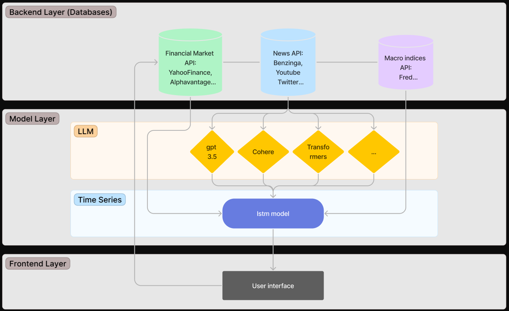
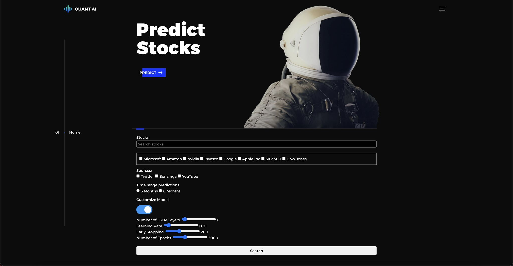

# QuantAI
As you're undoubtedly aware, the vast volume of news and rumors that emerge daily can be overwhelming, rendering it practically impossible for an individual to thoroughly process each piece of information. To counter this challenge, we have integrated cutting-edge LLMs to develop an innovative application designed to assist users in comprehending market sentiment.

Our application harnesses the power of user-specified sources, processing and analyzing vast amounts of data with exceptional accuracy. It leverages the capabilities of LSTM models, a type of recurrent neural network well-suited for sequence prediction problems, to predict market trends.

This integration of LLMs and LSTM models provides a robust and comprehensive solution to keep up with the pace of real-time information flow, resulting in a powerful tool for understanding and predicting market sentiment. The ultimate goal is to empower our users to make informed decisions based on accurate, up-to-date, and predictive insights.
(Initially built for Tribe AI Hackathon)

## Content Table
1. [Application Structure](#application-structure)
2. [Interface](#interface)
3. [LLMs Comparison](#llms-comparison)
4. [Future Development](#future-development)
5. [Contributors](#contributors)
6. [License](#license)

## Application Structure 

## Interface

## LLMs Comparison
| Model              | Comment                                                                                                                                                                                                                                                                                                                                                                                                                                                                                       |
|----------------------|---------------------------------------------------------------------------------------------------------------------------------------------------------------------------------------------------------------------------------------------------------------------------------------------------------------------------------------------------------------------------------------------------------------------------------------------------------------------------------------------|
| Cohere - Generate  | Generally reliable, although occasional discrepancies may arise.                                                                                                                                                                                                                                                                                                                                                                                                                             |
| Cohere - Classify  | User-friendly, may face challenges in sentiment classification with limited training data (e.g., 30 examples).                                                                                                                                                                                                                                                                                                                                                                               |
| Gpt 3.5 - davinci  | Highly accessible, offers adjustable parameters for enhanced input and output control.                                                                                                                                                                                                                                                                                                                                                                                                      |
| Gpt 3.5 - turbo    | Demonstrates comparable performance to davinci, with the added benefits of speed and cost.                                                                                                                                                                                                                                                                                                                                                                                                  |

## Future Development
- Use cloud services to host the website and establish an automated pipeline for regular updates of the latest market data. This will ensure that users have access to real-time information and enhance the overall user experience.

- Develop and train fined-tuned Transformers models specifically tailored for market analysis. Fine-tuning these models with domain-specific data will help maximize their accuracy and make them more effective in predicting market trends and outcomes.

- Expand the range of data sources by leveraging web scraping tools to gather additional sentiment and market signal features. By incorporating a broader range of information, the models can capture more comprehensive insights and improve the accuracy of market predictions.

- Explore ensemble modeling techniques to combine predictions from multiple models or approaches. Continuously monitor and evaluate the model's performance and regularly update and retrain the models as new data becomes available. This will ensure that the models remain accurate and adaptive to changing market conditions.

- Integrate this market analysis system with trading APIs to support strategy development, backtesting, and automated trading. 

## Contributors

## License
MIT License

Disclaimer: We are sharing codes for academic purpose under the MIT education license. 
Nothing herein is financial advice, and NOT a recommendation to trade real money. Please use common sense and always first consult a professional before trading or investing.
